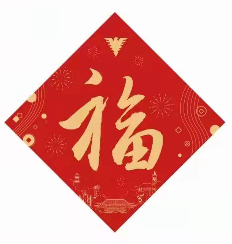

# WestCity



E-MAIL
======

```bash
CHINA_VIP_CLUB33@CECCCC.COM
```

西部集市
======

集市平仓
```bash
为平准货物价而储备一定量市场流通的物品，依据市场供需平衡投放市场从而进一步稳定市场物价。
````

集市平准
```bash
以货币、积分等现实/虚拟货币,调节生产、流通、消费之间的关系。
````

```bash
开市汇兑:  3月3日-3月15日[ 3月3日   3月5日-3月12日  3月15日]  
开市汇兑:10月1日-10月15日[10月1日 10月3日-10月10日 10月15日] 

上市退市:品牌在商城活动行为
入场退场:单品在商城活动行为
上市:
入场:
退市:
退场:
 ```
金融城

```bash
单位:元 币种:
人民币(RMB)
事务积分(μm)
行政积分(AP)
商业积分(CP)

RMB汇率:1RMB=10角=100分
1月-6月汇率:1RMB=10角=100分=1000μm=10000AP=100000CP
7月-12月汇率:1RMB=10角=100分=10000μm=100000AP=1000000CP

```
集市商城
```bash
休市期
 ```


年度:2022年 
---

刷分任务    集市分值:30000000

```bash
1、公务行政类:社保公积金开户/更新/销户,10000AP/1次,单项任务.
2、商务贸易类:出售苹果5吨需要的联系,1000000CP/1次,单项任务.
3、事务活动类:中秋节晚会活动,100000μm/1次,单项任务.
4、委托代办类:代办养老金领取,1000μm/1次,单项任务.
5、私家专项类:接送宝宝上学、放学,100μm/1次,月度任务.
```


